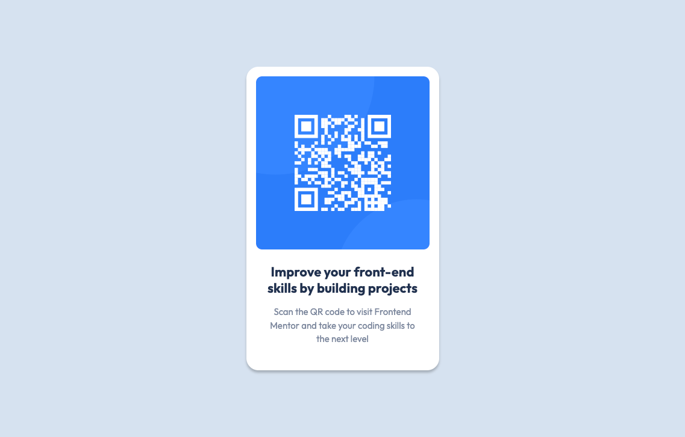

# Frontend Mentor - QR code component solution

This is a solution to the [QR code component challenge on Frontend Mentor](https://www.frontendmentor.io/challenges/qr-code-component-iux_sIO_H). Frontend Mentor challenges help you improve your coding skills by building realistic projects.

## Table of contents

- [Overview](#overview)
  - [Screenshot](#screenshot)
  - [Links](#links)
- [My process](#my-process)
  - [Built with](#built-with)
  - [What I learned](#what-i-learned)
  - [Continued development](#continued-development)
  - [Useful resources](#useful-resources)
- [Author](#author)

## Overview

### Screenshot

### Links

- Solution URL: https://github.com/stefan-holmgren/fem-qr-code-component
- Live Site URL: https://stefan-holmgren.github.io/fem-qr-code-component

## My process

### Built with

- Semantic HTML5 markup
- CSS custom properties
- CSS Grid

**Note: These are just examples. Delete this note and replace the list above with your own choices**

### What I learned

- Nice to try to follow a design and try to figure out how to make it work.
- Using `display: grid;` instead of `display: flex;` to make the layout work.
- Trying to use css variables to make the code more readable and easier to maintain.

### Continued development

Will try to learn more about semtantic markup and how to utilize css variables.

### Useful resources

- [Kevin Powell on Youtube](https://www.youtube.com/@KevinPowell) - Loving his way of teaching. Gold mine of information.

## Author

- Frontend Mentor - [@stefan-holmgren](https://www.frontendmentor.io/profile/stefan-holmgren)
